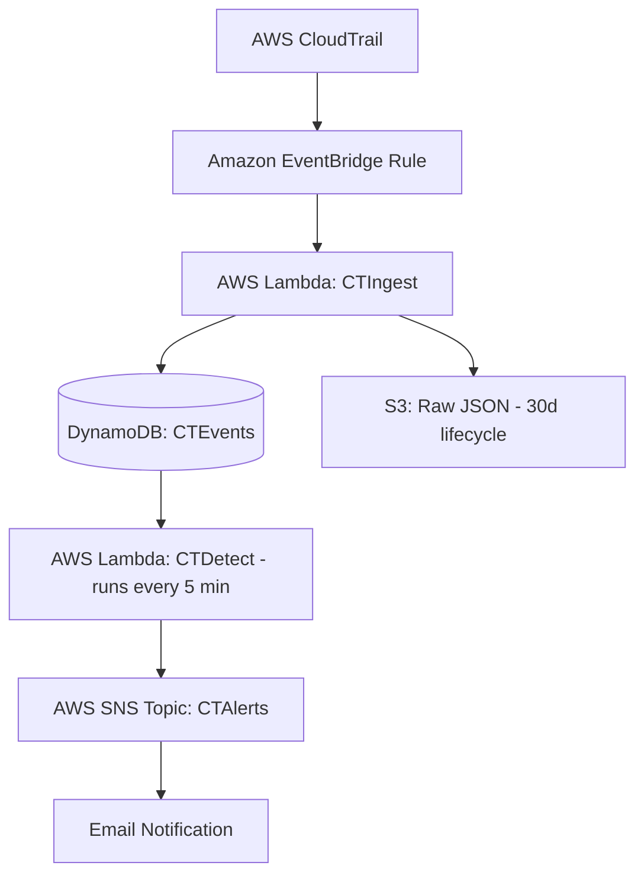

# ☁️ AWS CloudTrail Threat Detection (Serverless, Free Tier)

A real-time, serverless security monitoring system on AWS that ingests CloudTrail events, scores them for anomalies, and emails alerts. Built entirely on **AWS Free Tier**.

## 🧩 Architecture

## 🚀 Features
- Detects **suspicious AWS IAM or console activity** (like unexpected logins or privilege changes) via CloudTrail.
- Real-time ingestion using **EventBridge + Lambda + DynamoDB + SNS**.
- **Automated anomaly scoring** and alert generation.
- **Email alerts** for high-risk activities (via AWS SNS).
- **Serverless + Free Tier friendly** — no EC2, no paid services required.
- S3 logs auto-expire in 30 days to stay within free-tier limits.

---

## 🧱 Stack
**AWS Services Used:**
- **CloudTrail** → Tracks all API activity.
- **EventBridge** → Triggers Lambda on CloudTrail events.
- **Lambda (Python)** → Processes, normalizes, and scores events.
- **DynamoDB** → Stores normalized events.
- **S3** → Stores raw CloudTrail logs (30-day lifecycle).
- **SNS** → Sends alert notifications via email.
- **IAM** → Role-based access for each Lambda function.

---

## ⚙️ Deployment Cheatsheet
1. **Create an S3 Bucket**  
   Enable default SSE-S3 encryption, set 30-day lifecycle expiration.

2. **Create a DynamoDB Table**  
   Name: `CTEvents`  
   Partition key: `pk (String)`

3. **Create an SNS Topic**  
   Name: `CTAlerts`  
   Add your email subscription and confirm via the email you receive.

4. **IAM Roles**  
   Grant these permissions:
   - `dynamodb:PutItem`, `dynamodb:Scan`, `sns:Publish`, `s3:PutObject`, `logs:*`

5. **Deploy Lambda Functions**  
   - `CTIngest`: Parses and writes normalized CloudTrail data to DynamoDB/S3  
   - `CTDetect`: Scans DynamoDB, computes scores, and triggers SNS alerts

6. **EventBridge Rule**  
   - Pattern: Triggers CTIngest Lambda when new CloudTrail logs arrive.

7. **Scheduler**  
   - Runs CTDetect Lambda every 5 minutes.

---

## 📧 Sample Alert
**Subject:** `Anomalous AWS Activity Detected`  
**Message:**

